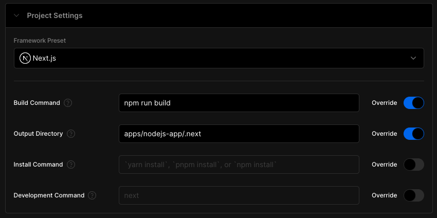
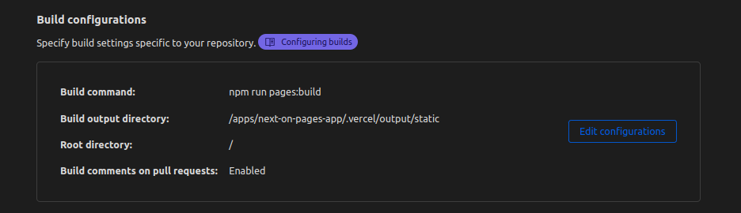

# Next.js 13 App Playground Migration POC

## Steps

### Turned repo into monorepo

Turned the repository into a monorepo by using turborepo, as part of this I've updated my project settings to that Vercel picks up the changes normally on push:



### Created next-on-pages app

Using
```sh
npm create cloudflare
```
I've created a new next-on-pages application in `apps/`

> **Note**
> I opted out to having my application deployed as I want to use the GitHub Pages integration

Integrated the new next-on-pages app with Pages so that it also deploys on push.



### Created gateway worker

Using
```sh
npm create cloudflare
```
I've created a new gateway worker in `apps/`
